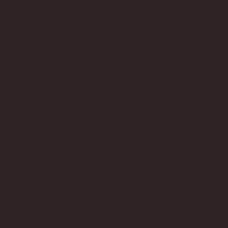

# Brand & Style Guide
This is a Guide for those who are interested in contributing to the Ballerini Comunity. This Repo stores all assets and design standards used throughout the Ballerini Project.

If, by any chance, you feel there is any content missing, please feel free to contribute and create a Pull Request or send us a message in our [Discord Server](https://discord.gg/ballerini).

### Disclaimer
Despite this documentation, the Design Standards may change without further notice.

## General Information
 - Do not modify or alter the logo or any Asset provided in this documentation.
 - Do not use it in places where the team has not authorized in terms of sponsorship for events or endorsements.
 - Do not use it in any non-opensource projects, without further approval.
 - Always use our official, unmodified Ballerini brand assets to represent our brand.
 - Capitalize the word “BALLERINI”, except when it’s part of a web address.
 - Do not rotate or change the alignment or direction of the brand assets.
 - Do not change the colour of Ballerini brand assets.

## Fonts
Throughout the Ballerini Project, we use several fonts. Unfortunately, some of them are not freeware and require a license. On the other hand, we have included alternate fonts in the repository that may be used for your projects.

| Name | Usage | Price |
|---------|----------|-------|
|[DIN Rundschrift](https://www.wfonts.com/font/din-rundschrift)| Main Font, used in Titles and Headers. *Capitalized*| *Free for Personal Use*
|[Norwester](https://www.fontsquirrel.com/fonts/norwester)| Used in Calendar for week days. *No Latin Version* | *Free for Personal Use*
|[Teko](https://fonts.google.com/specimen/Teko)| Used as a alternate for Norwester due to the Latin charset | *Free*
|[Genty Sans](https://creativemarket.com/Flavortype/5150494-Genty-Bold-Rounded-Typeface?u=jack.john)| Used in the Calendar for Events | *Paid*
|[Concert One](https://fonts.google.com/specimen/Concert+One)| Genty Sans Alernative | *Free for Personal Use*

## Color Palette

| Preview | Hex Code | RGB | HSL | Usage |
|---------|----------|-----|-----|-------|
||#2F2325|47, 35, 37|350, 15%, 16%|Background|
||#A45A49|162, 89, 73|11, 38%, 46%|Primary|
||#E68E7B|230, 142, 123|11, 68%, 69%|Alt|
||#FFFFFF|255, 255, 255|0, 0%, 100%|White|
||#97D4D9|151, 212, 217|185, 46%, 72%|Pastel Blue|
||#FEAFBE|254, 175, 190|349, 98%, 84%|Pastel Pink|
||#B3DFD3|179, 223, 211|164, 41%, 79%|Pastel Green|
||#EFC764|239, 199, 100|43, 81%, 66%|Pastel Yellow|
||#FFF2E7|255, 242, 231|27, 100%, 95%|Pastel Light Pink|

## Figma Template

For those who use [Figma](www.figma.com), we have included a template that can be used to create a new project. This template has Color Presets and some of the most common components.

Duplicate the template and rename it to your project name.

[GET TEMPLATE](https://www.figma.com/file/6h1AgZe3I5lYmD3mxu9cjR/Ballerini-Style-Guide/duplicate)

### Version

This documentation is in version v1.0. Last edited: 08/2021. 
